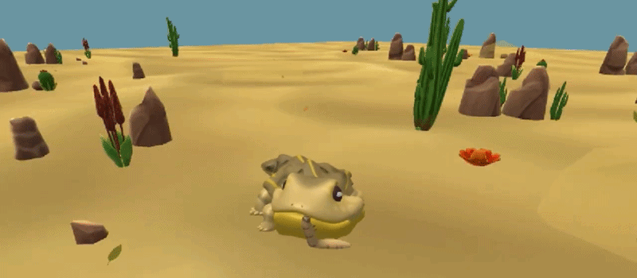

A Unity project featuring a fully procedurally animated bearded dragon with realistic movement, head tracking, eye tracking, and inverse kinematics leg stepping. The beardied dragon autonomously follows a target and walks towards the target following user-given parameters.

## Features
- **Procedural Leg Stepping** - Realistic four-legged IK locomotion driven by 'handles' and 'homes'
- **Eye Tracking** - Independent eye movement with rotation limits for natural looking tracking
- **Head Tracking** - Head has a smooth rotation toward a given target with parent constraints
-  **Root Motion AI** - Autonomous movement system that moves towards the target and will stop at a user-defined distance away
- **Custom 3D Models** - Bearded dragon and worm modeled and rigged in Blender
- **Fully Configurable** - Extensive inspector controls for fine-tuning behavior

## How It Works

- The underlying logic is driven by various realtionships between objects - specifically the realtionships between Inverse Kinematic handles and their pole vectors. Because the two rely on each other for placment of meshs, they can be manipulated to create a 'stepping' motion. The 'stepper' code then expands upon the resulting motion, adding dampening and randomness. Similarly the code builds upon the root-target relationship, adding a minium and maxium distance among other details that allow for a fluid, realistic animation that is responsive to the user. 
> see  for a more in-depth exploration

## Learning Resources

- [Inverse Kinematics explained](https://www.youtube.com/results?search_query=inverse+kinematics+unity)
- [Procedural animation techniques](https://www.gdcvault.com/play/1020583/Animation-Bootcamp-An-Indie-Approach)
- Unity documentation on [Quaternions](https://docs.unity3d.com/ScriptReference/Quaternion.html)

---

**Note**: This is a learning project focused on procedural animation techniques. The code prioritizes clarity and educational value over production optimization.
